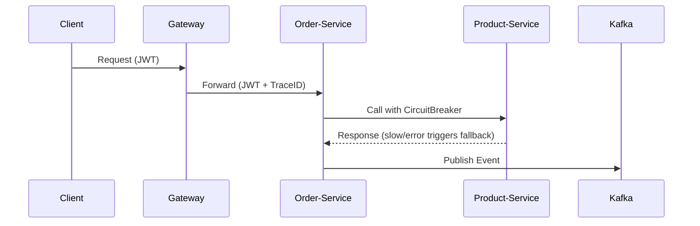

# 🛒 Demo E-Commerce (Minimal PoC)

Minimal **Spring Boot Microservices PoC** with **production-like integrations**:

* **Gateway + Eureka + Config Server** (Service Discovery + Centralized Config)
* **Keycloak** for OAuth2 (JWT validation, M2M)
* **Circuit Breaker (Resilience-4j)** with fallback
* **Kafka + Zookeeper** for async events
* **Observability**: OpenTelemetry Collector + Jaeger
* **Monitoring**: Prometheus + Grafana
* **Logging**: Loki + Promtail (structured logs in Grafana)
* **Caching + Rate Limiting**: Redis (Gateway `RequestRateLimiter`)
* **CI/CD**: GitHub Actions with automated versioning & container registry
* **Quality**: SonarQube + Jacoco + Integration Tests (Testcontainers)
* **API Docs**: Spring REST Docs auto-packaged in JARs

## 🏗️ Architecture Overview



---
## 🚀 Quick Start

### 🐳 Using Pre-built Images (Recommended)
```bash
# Pull latest images from GitHub Container Registry and start
docker compose pull && docker compose up -d
```

### 🔨 Local Development Build
```bash
# Switch to local build - edit docker-compose.yml:
# Comment: image & platform lines
# Uncomment: build section for each service

# Full clean rebuild with local images
docker compose down -v && docker image prune -f && docker compose up --build

# Build individual service
docker build --no-cache -f Dockerfile.optimized --build-arg MODULE=server-gateway .
```

### 📊 Code Analysis
```bash
# Run SonarQube analysis
docker compose --profile analysis up sonar-analysis
```

---

## 🔗 Service Endpoints

| Service   | URL                         | Port  | Description                    |
|-----------|-----------------------------|-------|--------------------------------|
| Gateway   | http://localhost:8090       | 8090  | API Gateway with rate limiting |
| Eureka    | http://localhost:8761       | 8761  | Service discovery dashboard    |
| Keycloak  | http://localhost:8080/admin | 8080  | Identity & Access Management   |
| Jaeger    | http://localhost:16686      | 16686 | Distributed tracing UI         |
| Grafana   | http://localhost:3000       | 3000  | Metrics & logging dashboard    |
| SonarQube | http://localhost:9000       | 9000  | Code quality analysis          |

### 📚 API Documentation
Spring REST Docs are auto-generated and packaged with each service:
- **Order Service**: http://localhost:8090/order/docs/index.html
- **Product Service**: http://localhost:8090/product/docs/index.html
- Access via Gateway with valid JWT token

---

## 🔗 Request Flow with TraceID + JWT

### Example: `GET /order/test`

### 1️⃣ Client → Gateway
* JWT validated (`JwtAuthenticationToken`)
* TraceID generated
* Redis-based rate-limit applied

### 2️⃣ Gateway → Order-Service
* Routed via **Eureka**
* TraceID + JWT propagated
* Config fetched dynamically from **Config Server**

### 3️⃣ Order-Service
* JWT validated
* Calls **Product-Service** through RestTemplate
* Protected with **CircuitBreaker (Resilience-4j)**
* Fallback executed on errors/slowness
* Publishes event to **Kafka**

### 4️⃣ Product-Service
* JWT validated
* Returns response (or error/slow to trigger breaker)

---

## 🎯 Validated Features

✅ **End-to-end tracing** with TraceID propagation  
✅ **JWT validation** at each service hop  
✅ **Circuit breaker** with fallback mechanisms  
✅ **Rate limiting** enforced via Redis  
✅ **Event publishing** to Kafka (even during fallbacks)  
✅ **Centralized configuration** management  
✅ **Health checks** and metrics exposure  
✅ **API documentation** auto-generation  
✅ **CI/CD pipeline** with automated versioning

---

## 🔑 Keycloak Setup

Keycloak runs with **realm imports** (preconfigured):

* `master-realm.json` → disables SSL requirement (`sslRequired=NONE`)
* `demo-ecommerce-realm.json` → preloads:
    * Clients: `gateway-service`, `order-service`, `product-service`
    * Roles for demo usage
    * M2M tokens enabled (users not exported)

**Manual initialization** (if needed):
```bash
./imports/init-keycloak.sh
```

---

## 🧪 Testing & Validation

### Get Access Token
```bash
# From gateway container
docker exec -it server-gateway bash
curl -X POST 'http://keycloak:8080/realms/demo-ecommerce/protocol/openid-connect/token' \
  -H 'Content-Type: application/x-www-form-urlencoded' \
  -d 'grant_type=client_credentials' \
  -d 'client_id=gateway-service' \
  -d 'client_secret=****'
```

### Test Scripts
```bash
# Circuit breaker testing
./imports/curls-test/test-circuit-breaker.sh

# Rate limiting testing  
./imports/curls-test/test-rate-limit.sh

# Full deployment validation
./verify.sh
```

**Rate Limiter Test Results:**
- `200 OK` until tokens exhausted
- `429 Too Many Requests` when limit exceeded
- Headers: `X-RateLimit-Remaining`, `X-RateLimit-Replenish-Rate`, `X-RateLimit-Burst-Capacity`
- Redis keys: `request_rate_limiter:*` (state stored in Redis, not memory)

---

## 📦 CI/CD Pipeline

### Automated Workflow
- **Trigger**: Push to `main` branch or pull requests
- **Versioning**: Automatic semantic version increment
- **Build**: Optimized multi-stage Docker builds
- **Testing**: Automated deployment validation
- **Publishing**: GitHub Container Registry with `:latest` and version tags
- **Release**: Automated GitHub releases with changelog

### Build Optimization
The CI uses an optimized Docker build strategy:
- **Shared dependency caching** across all microservices
- **Multi-architecture** support (AMD64)
- **Efficient layer caching** for faster builds

**Images available at:** `ghcr.io/puitiza/demo-ecommerce-*`

---

## 📊 Observability & Monitoring

* **Traces**: Jaeger UI → http://localhost:16686
* **Metrics**:
    * Prometheus → http://localhost:9090
    * Grafana → http://localhost:3000 (Dashboard: `Spring Boot Statistics 4701`)
* **Logging**:
    * Loki → http://localhost:3100
    * Logs ingested by **Promtail** from all containers
    * Searchable in Grafana Explore

**Metrics include:** HTTP requests/sec, latency (P95/P99), JVM pools, active threads, CPU & memory

---

## 📐 Quality & Documentation

* **SonarQube** → http://localhost:9000
    * Token auto-generated via `init.sh`
    * `sonar-analysis` container runs: `./gradlew clean test integrationTest jacocoTestReport sonar`
* **Jacoco** merges unit + integration test coverage
* **Spring Rest Docs** auto-packaged in JARs at `/docs` endpoint

---